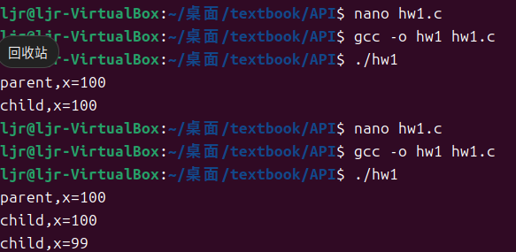
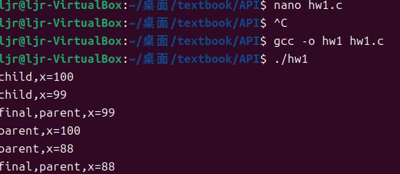

# 操作系统

### 操作系统是干什么的
管理硬件资源，让多个程序共享CPU、内存、磁盘等。
提供了API让应用程序调用。

### 什么是虚拟化
- 什么是虚拟化CPU
    多个程序看似同时运行，看似有许多CPU的假象。
- 什么是虚拟化内存
    不同程序使用同一片内存时互不影响。

### 什么是并发
将线程看作与其他函数在同一内存空间中运行的函数，甚且每一都有多个线程处于活动状态。
并发会导致奇怪的问题。

### 什么是持久性
文件系统是操作系统的一部分，负责管理持久的数据。

*** 

## 第一部分 虚拟化

通过时分共享time sharing技术实现虚拟cpu。

### 一 进程
    操作系统位正在运行的程序提供的抽象就是进程。
    进程的机器状态包括内存、寄存器等。
> 机制：how
> 策略：which
> 将策略和机制分开设计。

1. 进程API
   - 创建
   - 销毁
   - 等待
   - 状态
   - 其他控制
2. 进程创建
   操作系统将程序的代码和静态数据放到内存中，分配好栈和堆。
3. 进程状态
   - 运行：就绪时调度。
   - 就绪：运行时取消调度；阻塞时完成请求。
   - 阻塞：运行时发起请求。
4. 数据结构
   保存进程的信息，如进程列表。

### 二 进程API
#### 1. fork()系统调用
用于创建进程.   
在父进程中创建一个子进程, 父进程获取的返回值是子进程的PID, 子进程获取的返回值是0  
子进程会从调用fork()的那一行继续运行,而不是main函数.  
子进程和父进程运行顺序不确定  

#### 2. wait()系统调用
用于进程的等待  
父进程等子进程运行完之后才继续  

#### 3. exec()系统调用
可以用exec()在子进程中运行其他程序, 并非直接运行另一个程序,而是用其他程序的代码放到自己的进程里面  
没有创建新进程  
execvp() 是一个系统调用，用于在当前进程中执行一个新的程序。是 exec 系列函数的一部分.

#### 作业
* 1.编写一个调用fork()的程序。谁调用fork()之前，让主进程访问一个变量（例如x）
并将其值设置为某个值（例如 100）。子进程中的变量有谁谁值？当子进程和父进程都改变x的值谁，变量会发生谁谁？
见hw1.c
不修改,子进程和父进程变量值一样
子进程修改后,父进程值不变

### 三 机制:受限直接执行
#### 1.受限直接执行 limited direct execution
直接执行,就是创建进程,分配内存,将程序加载到内存中,初始化栈,进入main函数
#### 2.受限制的操作
* **用户模式user mode**
  * 不能执行受限命令
* **内核模式kernel mode**
  * 可以执行任何受限命令
   
* 用户可以通过**系统调用**访问一些关键功能
* **陷阱trap指令**进入内核,将特权提升到内核模式,**从陷阱返回return-from-trap指令**返回用户,将特权降低到用户模式
* 内核通过在启动时设置**陷阱表trap table**来实现,告诉硬件在
发生某些异常事件(包括系统调用)时要运行哪些代码。

#### 3.在进程之间切换
* #####  协作方式cooperative: 等待系统调用
    * 等待yield系统调用, 或者程序执行非法操作陷入trap
* ##### 非协作方式:操作系统进行控制
    * 时钟中断timer interrupt, 中断时, 程序停止, 中断处理程序运行, 操作系统控制cpu
* ##### 保存和恢复上下文
    * 操作系统的调度程序sheduler决定切换程序context switch时,将寄存器A保存至进程结构A,将进程结构B恢复到寄存器B, 从trap返回B  
* 在时钟中断之后,trap之前, 硬件回将寄存器A保存到内核栈A

> #### 进程结构和内核栈区别
>1. **用途不同**：
>   - 内核栈用于内核模式下的函数调用和中断处理。
>   - 进程结构用于存储和管理进程的状态信息和资源。
>2. **内容不同**：
>   - 内核栈包含函数调用的返回地址、本地变量、中断处理程序的上下文等。
>   - 进程结构包含进程ID、进程状态、程序计数器、寄存器内容、内存管理信息、打开的文件描述符等。
>3. **存储位置不同**：
>   - 内核栈位于内核地址空间中，每个进程都有一个独立的内核栈。
>   - 进程结构也存储在内核空间中，但它是一个数据结构，用于管理和跟踪进程的信息。
>4. **大小和分配**：
>   - 内核栈的大小通常是固定的（例如，4KB或8KB），在进程创建时分配。
>   - 进程结构的大小取决于操作系统的实现，包含所有必要的进程信息。
> 

> 因此，下次重启时，要相信自己不是在进行某种丑陋的粗暴攻击。实际上，你正在使用经过时间考验的方法来改善计算机系统的行为。干得漂亮！

### 四 进程调度: 介绍
#### .1 工作负载假设workload
#### .2 调度指标
  - ##### 周转时间 turnaround time:
      - $T_\text{周转时间}=T_\text{完成时间}-T_\text{到达时间} $
#### .3 先进先出FIFO
  - 缺点: 快的可能排在后面,浪费
#### .4 最短任务优先SJF Shortest Job First
  - 所有任务同时到达时,最优
  - 是非抢占式的 non-preemptive
  - 随时到达,不好
#### .5 最短完成时间优先STCF Shortest Time-to-Completion First
  - 每当新工作进入系统时，它就会确定剩余工作和新工作中，谁的剩余时间最少，然后调度该工作
  - 可以抢占preempt
#### .6 新调度指标
  - ##### 响应时间 response time:
      - $T_\text{响应时间}=T_\text{首次运行}-T_\text{到达时间} $
#### .7 轮转RR Round-Robin
  - 时间片 time slicing : 时钟周期的倍数
  - 每个时间片切换一个任务,队列中的下一个
  - 越短,越提高响应时间
  - 时间片不能太短,否则影响整体性能
    - 可以用摊销amortization,即增加时间片长度
    - 重叠overlap, 提高利用率,即不停的切换工作
  - 周转时间很差
#### .8 结合I/O
  - 一个程序再I/O时会阻塞,不会使用CPU
  - 可以趁机运行其他的程序
  - 通过将调用I/O的程序看作多个较短的子程序,然后使用STCF
#### .9 无法预知时间长度 

### 五 调度:多级反馈队列
#### 1.多级反馈队列 Multi-level  Feedback  Queue

# 其他

; Code segment descriptor
    .word 0xFFFF, 0x0000, 0x9A00, 0x00CF

0xFFFF,段界限limit

0x0000,基地址

0x9A00=B1001,1010,0000,0000
表示
P：存在位，P 为 1 表示段在内存中
DPL：描述符特权级，取值 0;0 特权级最高
S：描述符类型标志，S 为 1 表示代码段或数据段
TYPE：当 S 为 1，TYPE 表示的代码段，数据段的各种属性为可执行可读未访问

0x00CF,00基地址,C是1100,F为界限limit
G 为 1 时，该 20 位段限⻓左移 12 位后加上 0xFFF 即为实际段的最大⻓度(最大为 4GB)
在可执行代码段，该位叫做 D 位，D 为 1 使用 32 位地址和 32/8 位操作数
AVL：Available and Reserved Bit，通常设为 0

; Data segment descriptor
    .word 0xFFFF, 0x0000, 0x9200, 0x00CF

0xFFFF,段界限limit
0x0000,基地址

0x9200=B1001,0010,0000,0000
9同代码段
0010表示可读写数据段

0x00CF,00基地址,C是1100,F为界限limit
G 为 1 时，该 20 位段限⻓左移 12 位后加上 0xFFF 即为实际段的最大⻓度(最大为 4GB)
向下扩展的数据段中，该位叫做 B 位，B 为 1 段的上界为 4GB
0
AVL：Available and Reserved Bit，通常设为 0